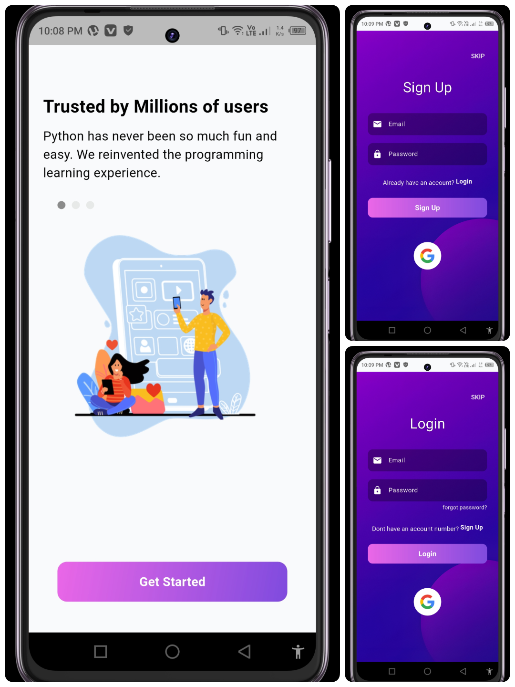
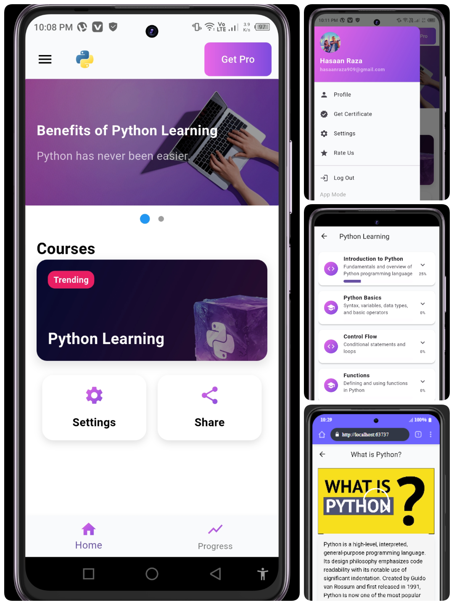

# Learn Python App

---

## **Introduction**

This is a mobile application built with **Flutter** for learning Python programming.
It provides an **interactive learning experience** with multiple features.
The app uses **Firebase** for authentication and data storage.
Supports **light and dark modes** for better user experience.

---

## **Screenshots**

> Add screenshots in the repository and link them here.


---

## **Features**

* Splash screens for smooth app loading.
* User login and signup with email verification.
* Direct Google signup for quick access.
* Forgot password functionality for credential reset.
* User progress tracker to monitor learning journey.
* Upload profile picture and change name options.
* Earn certificate upon course completion.
* Light and dark mode support for theme switching.
* Firebase database for secure data handling.
* Interactive content tiles with progress-based locking.
* Quizzes for each topic with score tracking.
* Toast messages for instant feedback.

---

## **Technologies Used**

* **Flutter** for cross-platform mobile development.
* **Dart** as the programming language.
* **Firebase** for authentication, Firestore, Realtime Database, and Storage.
* **Google Sign-In** integration for user authentication.
* **Provider** for state management.
* **Toastification** for toast notifications.

---

## **Installation**

1. Clone the repository:

```bash
git clone [https://github.com/yourusername/learn-python-app.git](https://github.com/alisraza123/python_learning_flutter)
```

2. Navigate to the project directory:

```bash
cd learn-python-app
```

3. Install dependencies:

```bash
flutter pub get
```

4. Set up Firebase:

   * Add `google-services.json` for Android.
   * Add `GoogleService-Info.plist` for iOS.
   * Enable **Email/Password** and **Google Sign-In**.
   * Enable Firestore, Realtime Database, and Storage.
5. Run the app:

```bash
flutter run
```

---

## **Usage**

* Launch the app to see the splash screen.
* Sign up or log in using email or Google.
* Explore Python lessons and track progress.
* Tap on topics to expand and view subtopics.
* Complete subtopics to unlock next lessons.
* Take quizzes and view scores.
* Update profile details as needed.
* Earn certificates upon course completion.
* Switch between **light** and **dark modes**.

---

## **Contributing**

* Contributions are welcome!
* Fork the repository and submit pull requests.
* Follow the **code style guidelines**.
* Report issues via **GitHub Issues**.

---

## **Folder Structure**

* `lib/screens/` - All screens (Splash, Login, Learning, Quiz, Profile, Certificate)
* `lib/widgets/` - Reusable widgets (TopicCard, ProgressBar, etc.)
* `lib/models/` - Data models for topics and content
* `lib/data/` - Static data (Python topics)
* `lib/colors/` - Color constants
* `lib/screens/providers/` - State management (Progress Provider,Theme Provider)
* `assets/` - Images, icons, and screenshots

---

## **Author**

Name: Ali Raza
Email: alisraza123@gmail.com
